<div align="center">


# 🎓 Student Academic Project Management System

### A Modern, Full-Featured Platform for Managing Academic Projects

[](https://reactjs.org/)
[](https://www.typescriptlang.org/)
[](https://tailwindcss.com/)
[](https://vitejs.dev/)
[](LICENSE)

[Features](#-features) • [Installation](#-installation) • [Usage](#-usage) • [Admin Access](#-admin-credentials) • [Tech Stack](#-tech-stack)

</div>

---

## 📋 Overview

The **Student Academic Project Management System** is a comprehensive web application designed to streamline the management of academic projects. Built with modern technologies, it provides an intuitive interface for students and administrators to collaborate, track progress, and evaluate projects efficiently.

### 🎯 Perfect For

- 🏫 Universities and Educational Institutions
- 👨‍🎓 Student Project Teams
- 👨‍🏫 Faculty and Administrators
- 📊 Academic Project Evaluation

---

## ✨ Features

### 🔐 **Authentication & User Management**
- Email/Password authentication
- Google Sign-In integration
- Role-based access control (Students, Team Leads, Admins)
- User profile management with avatars

### 👥 **Team Registration & Management**
- Create and register project teams
- Invite team members via email
- Team proposal system with acceptance workflow
- Automatic team lead assignment

### 📈 **Advanced Progress Tracking**
- **Multiple View Modes**: List, Kanban Board, and Calendar views
- Task assignment and due date management
- Real-time progress updates
- Task commenting system for collaboration
- Status tracking (To Do → In Progress → Done)

### 📄 **Report Submission System**
- Submit project reports with document links
- Version control for multiple submissions
- Download and review previous submissions
- Submission history tracking

### 💾 **Project Database**
- Centralized project repository
- Advanced search and filtering
- Project metadata management
- Team information display

### 🎯 **Comprehensive Evaluation Model**
- Multi-criteria evaluation system
  - Innovation & Originality
  - Execution & Functionality
  - Documentation Quality
- Weighted scoring mechanism
- Admin-only evaluation interface
- Detailed feedback system
- Real-time grade calculations

### 🎨 **Modern UI/UX**
- Dark/Light theme toggle
- Responsive design for all devices
- Glassmorphism effects
- Smooth animations and transitions
- Mobile-friendly navigation
- Toast notifications for user feedback

---

## 🔑 Admin Credentials

### Default Administrator Accounts

The system recognizes the following email addresses as administrators with full privileges:

```
📧 Email: admin@acadex.edu
🔐 Password: admin@123

📧 Email: admin@protrack.edu  
🔐 Password: (Set during first-time setup)
```

> **Note**: Admin users have access to:
> - Project evaluation interface
> - All team data and submissions
> - User management capabilities
> - System-wide analytics
> - Enhanced UI with admin branding (cyan accents)

### Setting Up Admin Account

1. Navigate to the signup page
2. Register using one of the admin email addresses above
3. Set your secure password
4. Admin privileges will be automatically granted

---

## 🛠️ Tech Stack

```mermaid
graph LR
    A[⚛️ React 18.3.1] --> B[TypeScript]
    A --> C[Vite]
    B --> D[🎨 Tailwind CSS]
    D --> E[shadcn/ui]
    E --> F[Radix UI]
    A --> G[React Router]
    A --> H[TanStack Query]
    A --> I[React Hook Form]
    I --> J[Zod]
    D --> K[Lucide Icons]
    
    style A fill:#61DAFB,stroke:#000,color:#000
    style B fill:#3178C6,stroke:#fff,color:#fff
    style C fill:#646CFF,stroke:#fff,color:#fff
    style D fill:#38B2AC,stroke:#fff,color:#fff
    style E fill:#000,stroke:#fff,color:#fff
```

<div align="center">



</div>

### Frontend
- **[React](https://reactjs.org/) 18.3.1** - Modern UI library
- **[TypeScript](https://www.typescriptlang.org/)** - Type-safe development
- **[Vite](https://vitejs.dev/)** - Lightning-fast build tool
- **[Tailwind CSS](https://tailwindcss.com/)** - Utility-first styling
- **[Lucide React](https://lucide.dev/)** - Beautiful icon library

### UI Components
- **[shadcn/ui](https://ui.shadcn.com/)** - High-quality component library
- **[Radix UI](https://www.radix-ui.com/)** - Accessible primitives
- **[React Router DOM](https://reactrouter.com/)** - Client-side routing
- **[Sonner](https://sonner.emilkowal.ski/)** - Toast notifications

### State Management & Data
- **React Hooks** - Built-in state management
- **[TanStack Query](https://tanstack.com/query/)** - Server state management
- **[React Hook Form](https://react-hook-form.com/)** - Form handling
- **[Zod](https://zod.dev/)** - Schema validation

### Additional Features
- **[next-themes](https://github.com/pacocoursey/next-themes)** - Dark Mode integration
- **[tailwindcss-animate](https://github.com/jamiebuilds/tailwindcss-animate)** - Animations
- **[date-fns](https://date-fns.org/)** - Date Handling
- **[Recharts](https://recharts.org/)** - Charts for data visualization

---

## 📈 Project Metrics & Insights

<div align="center">

### 📊 Repository Statistics


### ⭐ Project Activity


### 🎯 Feature Completion Status


</div>

---

## 📦 Installation

### Prerequisites

- **Node.js** 18.x or higher
- **npm** or **bun** package manager
- Modern web browser

### Step 1: Clone the Repository

```bash
git clone https://github.com/yourusername/student-project-management.git
cd student-project-management
```

### Step 2: Install Dependencies

```bash
npm install
# or
bun install
```

### Step 3: Environment Configuration

Create a `.env` file in the root directory:

```env
# Firebase Configuration (if using external backend)
VITE_FIREBASE_API_KEY=your_api_key
VITE_FIREBASE_AUTH_DOMAIN=your_auth_domain
VITE_FIREBASE_PROJECT_ID=your_project_id
VITE_FIREBASE_STORAGE_BUCKET=your_storage_bucket
VITE_FIREBASE_MESSAGING_SENDER_ID=your_messaging_sender_id
VITE_FIREBASE_APP_ID=your_app_id
VITE_FIREBASE_MEASUREMENT_ID=your_measurement_id
```

### Step 4: Start Development Server

```bash
npm run dev
# or
bun run dev
```

The application will be available at `http://localhost:8080`

---

## 🚀 Usage

### For Students

1. **Sign Up**: Create an account using your institutional email
2. **Create/Join Team**: Register a new project team or accept an invitation
3. **Track Progress**: Add tasks, set deadlines, and update status
4. **Submit Reports**: Upload project documentation and reports
5. **View Evaluation**: Check your project scores and feedback

### For Team Leads

- All student capabilities, plus:
- Create and manage project teams
- Invite team members
- Assign tasks to team members
- Manage team submission deadlines

### For Administrators

- All student/lead capabilities, plus:
- Access evaluation interface
- Review all project submissions
- Provide detailed feedback and scores
- View system-wide analytics
- Manage user accounts

---

## 📱 Screenshots

### Dashboard
Modern, intuitive dashboard with quick access to all features.

### Team Registration
Streamlined team creation with member invitation system.

### Progress Tracking
Multiple views (List, Kanban, Calendar) for flexible task management.

### Evaluation Interface
Comprehensive scoring system with detailed feedback capabilities.

---

## 🗂️ Project Structure

```
Acadex/
├── 📁 public/
│   ├── robots.txt           # SEO configuration
│   ├── favicon.ico          # Site icon
│   └── placeholder.svg      # Default placeholder image
│
├── 📁 src/
│   ├── 📁 components/       # React components
│   │   ├── 📁 ui/          # Shadcn/ui component library (50+ components)
│   │   │   ├── button.tsx
│   │   │   ├── card.tsx
│   │   │   ├── dialog.tsx
│   │   │   ├── form.tsx
│   │   │   ├── tabs.tsx
│   │   │   └── ... (40+ more)
│   │   ├── Navigation.tsx   # Main navigation component
│   │   └── NavLink.tsx      # Navigation link helper
│   │
│   ├── 📁 pages/           # Application pages
│   │   ├── Home.tsx        # Landing page & dashboard
│   │   ├── Teams.tsx       # Team registration & management
│   │   ├── Projects.tsx    # Project database & search
│   │   ├── Evaluation.tsx  # Admin evaluation interface
│   │   └── NotFound.tsx    # 404 error page
│   │
│   ├── 📁 hooks/           # Custom React hooks
│   │   ├── use-mobile.tsx  # Mobile detection hook
│   │   └── use-toast.ts    # Toast notification hook
│   │
│   ├── 📁 lib/             # Utility functions
│   │   └── utils.ts        # Helper utilities
│   │
│   ├── App.tsx             # Main application component
│   ├── App.css             # Component-specific styles
│   ├── main.tsx            # Application entry point
│   ├── index.css           # Global styles & design tokens
│   └── vite-env.d.ts       # Vite type definitions
│
├── 📄 Configuration Files
├── index.html              # HTML entry point
├── vite.config.ts          # Vite build configuration
├── tailwind.config.ts      # Tailwind CSS configuration
├── tsconfig.json           # TypeScript configuration
├── tsconfig.app.json       # App-specific TS config
├── tsconfig.node.json      # Node-specific TS config
├── eslint.config.js        # ESLint configuration
├── postcss.config.js       # PostCSS configuration
├── components.json         # Shadcn/ui component config
├── package.json            # Dependencies & scripts
├── package-lock.json       # Dependency lock file
└── README.md              # Project documentation
```

### 📊 Project Statistics


### 🏗️ Architecture Overview

```mermaid
graph TB
    A[🌐 Entry Point<br/>index.html] --> B[⚛️ React App<br/>main.tsx]
    B --> C[📱 App.tsx<br/>Router & Layout]
    C --> D[🧭 Navigation]
    C --> E[📄 Pages]
    
    E --> E1[🏠 Home]
    E --> E2[👥 Teams]
    E --> E3[📊 Projects]
    E --> E4[⭐ Evaluation]
    
    E1 --> F[🎨 UI Components<br/>shadcn/ui]
    E2 --> F
    E3 --> F
    E4 --> F
    
    F --> G[🎣 Custom Hooks]
    F --> H[🔧 Utilities]
    
    style A fill:#4A90E2
    style B fill:#50C878
    style C fill:#9B59B6
    style E fill:#E67E22
    style F fill:#E91E63
    style G fill:#00BCD4
    style H fill:#FF9800
```



---

## 🎨 Design System

The application uses a carefully crafted design system with:

- **Color Palette**: Dark blue and cyan accents for modern look
- **Typography**: System fonts with careful hierarchy
- **Spacing**: Consistent 4px/8px grid system
- **Components**: Reusable, themed components
- **Animations**: Smooth, performant transitions
- **Responsive**: Mobile-first approach

---

## 🔒 Security Features

- Secure authentication flow
- Role-based access control
- Protected routes
- Environment variable management
- Input validation and sanitization
- XSS protection

---

## 🌐 Browser Support

- ✅ Chrome (latest)
- ✅ Firefox (latest)
- ✅ Safari (latest)
- ✅ Edge (latest)
- ✅ Mobile browsers

---

## 📈 Performance

- ⚡ Lightning-fast Vite build
- 🎯 Code splitting for optimal loading
- 📦 Optimized bundle size
- 🔄 Efficient re-rendering
- 💾 Smart caching strategies

---

## 🤝 Contributing

Contributions are welcome! Please follow these steps:

1. Fork the repository
2. Create your feature branch (`git checkout -b feature/AmazingFeature`)
3. Commit your changes (`git commit -m 'Add some AmazingFeature'`)
4. Push to the branch (`git push origin feature/AmazingFeature`)
5. Open a Pull Request

### Development Guidelines

- Follow TypeScript best practices
- Use semantic commit messages
- Write meaningful comments
- Test your changes thoroughly
- Update documentation as needed

---

## 🐛 Bug Reports

Found a bug? Please open an issue with:

- Detailed description
- Steps to reproduce
- Expected vs actual behavior
- Screenshots (if applicable)
- Browser/OS information

---

## 📄 License

This project is licensed under the **MIT License** - see the [LICENSE](LICENSE) file for details.

---

## 👨‍💻 Authors

Created with ❤️ by the Academic Project Management Team

---

## 🙏 Acknowledgments

- [Lovable](https://lovable.dev) - Development platform
- [shadcn/ui](https://ui.shadcn.com/) - Component library
- [Tailwind CSS](https://tailwindcss.com/) - Styling framework
- [Lucide](https://lucide.dev/) - Icon library
- All contributors and testers

---

## 📞 Support

Need help? Reach out:

- 📧 Email: support@acadex.edu
- 💬 Discord: [Join our community](#)
- 📚 Documentation: [View Docs](#)
- 🐛 Issues: [Report Bug](https://github.com/yourusername/student-project-management/issues)

---

## 🗺️ Roadmap

### Upcoming Features

- [ ] Real-time collaboration features
- [ ] File upload for project documents
- [ ] Email notifications system
- [ ] Advanced analytics dashboard
- [ ] Export reports as PDF
- [ ] Mobile native apps
- [ ] Integration with popular LMS platforms
- [ ] AI-powered project recommendations

---

<div align="center">

### ⭐ Star this repository if you find it helpful!

Made with 💙 using React, TypeScript, and Tailwind CSS

**[Back to Top](#-student-academic-project-management-system)**

---


</div>
